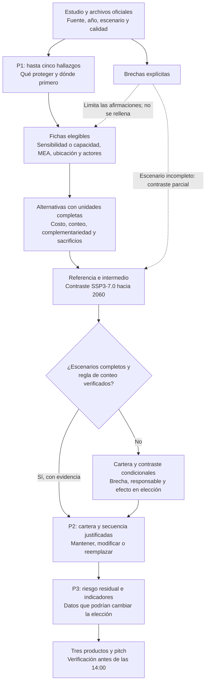
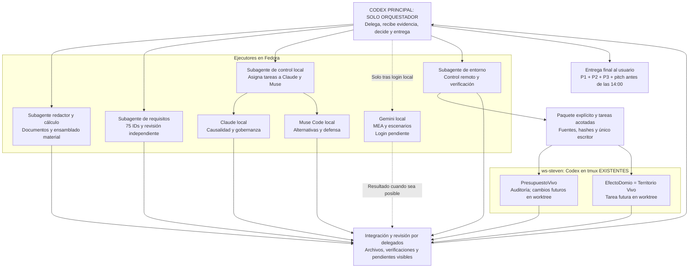

# Propuesta para el equipo: decisión ambiental y cumplimiento integral

**Texto para leer al equipo.** Proponemos liderar con **Presupuesto Vivo** y apoyar con **Territorio Vivo** para decidir qué proteger, dónde intervenir y qué combinación de adaptación financiar en Rionegro–Guarne–Marinilla con el fondo simulado de COP 5.000 millones. Aprovecharemos sus avances y los antecedentes de PSA, restauración y agroecología, verificando continuidad y evitando duplicación. Partimos del estudio oficial: hasta cinco hallazgos, medidas vinculadas a disminuir sensibilidad o fortalecer capacidad adaptativa, comparación de carteras con costos completos, revisión de referencia/intermedio y SSP3-7.0/2060, y seguimiento MEA del riesgo que permanece. Los tres productos demostrarán decisión, rigor, priorización, pensamiento sistémico, robustez, gobernanza, seguimiento y utilidad para CORNARE; el pitch durará siete minutos. **Este Codex es únicamente el orquestador general: asigna, recibe evidencias, decide y entrega; los subagentes y las instancias ejecutoras realizan todo el trabajo material.** Claude, Muse y Gemini se usan en Fedora; en el remoto se controlan los tmux existentes. El máximo financiero ya está comprobado bajo una regla explícita, pero no demuestra la mejor cartera ambiental: faltan escenarios completos, fichas MEA, sitios y responsables. Cada brecha tiene responsable y condición de cierre. SpecOrganon aporta trazabilidad cuando ayude; entregaremos antes de las 14:00 de Bogotá.

**Estado del documento:** propuesta metodológica para deliberación, 7 de octubre de 2026. Las revisiones independientes y la preparación técnica están autorizadas y en curso. La goal de entrega y los cambios funcionales se activarán después de la deliberación solicitada. Este documento explica **cómo cumplir**; no declara cumplidos requisitos cuya evidencia todavía falta.

**Regla de operación vigente.** La instancia principal no redacta archivos, programa, calcula, ejecuta pruebas ni prepara el entorno. Solo instancia/delega tareas y controla las instancias disponibles. Conserva la dirección, las decisiones de integración y la entrega final al usuario. El redactor delegado escribe la síntesis; los ejecutores dejan sus resultados y verificaciones. Esta separación mantiene disponible al orquestador durante el trabajo paralelo. Un solo escritor por archivo y tareas con objetivo, entradas, restricciones, salida y comprobación.

## 1. Qué revisamos y qué documento gobierna cada decisión

Se revisaron `explicacion.txt`, las 19 secciones de la convocatoria preparatoria, los dos enunciados de ocho páginas, las 31 páginas de la presentación PDF, las 31 diapositivas y notas del PPTX, y las ocho hojas Excel completas: **858 filas de datos, 800 al excluir una copia idéntica**. Se contrastaron los 11 archivos útiles del ZIP contra sus miembros originales. Los archivos `__MACOSX` son metadatos de Apple, no explicaciones adicionales. También se inspeccionaron los cuatro repositorios remotos y sus evidencias anteriores de verificación.

La [revisión documental](revision_documentos.md), la [revisión de Excel](revision_excel.md) y el [inventario del ZIP](../insumos/inventario.json) permiten comprobar ese alcance. La [matriz de requisitos completa](matriz_requisitos_completa.md) contiene **75 IDs estables**: 22 reglas, nueve preguntas, ocho criterios, seis exclusiones, tres productos, tres reglas de formato, 16 insumos y ocho condiciones. Para cada uno indica fuente, acción, evidencia, responsable y estado. La falta de escenarios o fichas no se oculta detrás de haber leído todos los archivos recibidos.

Orden de autoridad: enunciado oficial del reto → presentación institucional como contexto → hojas de antecedentes → notas del operador → investigación y metas antiguas de las aplicaciones. Los pesos institucionales **70/15/15** no son pesos del jurado ni eficacia de las medidas. La meta del **30% de reducción de indicadores de vulnerabilidad corresponde a 2035**; no es un resultado observado ni una promesa para el primer año. El horizonte operativo de un año mencionado en las notas no permite fraccionar los precios oficiales.

## 2. Por qué estas dos iniciativas permiten responder al reto

| Iniciativa | Trabajo que aprovecharemos | Corrección o comprobación necesaria |
| --- | --- | --- |
| **Presupuesto Vivo, principal** | Registro de presupuesto, restricciones, alternativas, incertidumbre y explicación de una cartera. | Su motor minimax exige beneficios/efectividades y su desempate favorece **menos intervenciones**, por lo que no sirve como selector automático del máximo oficial. No se introducen coeficientes ficticios para desbloquearlo. Se usa comparación financiera reproducible y justificación ambiental explícita si falta eficacia institucional. |
| **Territorio Vivo, secundario** | Fuentes, localización, expediente, cobertura y seguimiento territorial. | Cambiar su caso provisional Granada–Rionegro al corredor Rionegro–Guarne–Marinilla. La cantidad de capas o documentos existentes no acredita que contenga las fichas oficiales del reto. |
| Efecto Dominó | Antecedentes de estructura para registrar dependencias y datos necesarios. | La matriz empresarial falta deliberadamente: no se rellenará por proximidad geográfica ni con cadenas inventadas. No se vuelve el proyecto principal. |
| Lote Resiliente | Apoyo eventual para localizar una actuación predial. | Su escala predial no resuelve por sí sola la distribución regional del fondo. Se reutiliza solo si una localización concreta lo requiere. |

La [comparación de las cuatro propuestas](seleccion_propuestas.md) detalla los avances. Las pruebas anteriores de los repositorios son evidencia técnica histórica; no demuestran eficacia ambiental ni que hoy esté resuelto el caso. Se revisarán únicamente las funciones necesarias para producir las tres salidas. El formato oficial permite tablas y láminas si una integración retrasa la decisión.

La [auditoría estática del Codex remoto de Presupuesto Vivo](../ambiente/evaluaciones/codex-presupuesto.md) confirma ese límite del motor (`src/engine/motor.ts:275`) y otros cuidados: su proxy social de vulnerabilidad no es el componente climático oficial, los multiplicadores genéricos no son el escenario SSP suministrado y su alcance actual no selecciona el corredor conjunto. Su costo de ciclo de vida tampoco sustituye el precio indivisible del ejercicio. La ruta mínima son las tablas oficiales; las funciones de aplicación se reutilizan únicamente cuando conservan ese significado. Esta auditoría no ejecutó el motor ni validó el caso ambiental.

## 3. Método operativo: de la evidencia a la elección

1. **Fijar frontera y procedencia.** Solo tres municipios; biodiversidad, recurso hídrico, seguridad alimentaria, hábitat, infraestructura, desastres y salud; escenarios existentes. Para cada dato registrar municipio, dimensión, factor, indicador, valor/unidad, año, escenario, archivo y página/celda. Etiquetar dato institucional, inferencia, supuesto o faltante. No convertir una categoría de evento de Excel en índice de vulnerabilidad.
2. **Escoger hasta cinco hallazgos que obliguen a decidir.** Contrastar sensibilidad, capacidad adaptativa, vulnerabilidad y riesgo, en lugar de ordenar municipios por un único índice. Revisar eventos históricos para comprobar fecha, recurrencia y contexto; cruzar las capas disponibles de agua/riesgo, POMCA y determinantes para validar localización y restricciones. Identificar qué activo o función se protege y dónde la evidencia permite localizarlo; si solo hay resolución municipal, mantener esa resolución. Un enlace a una fuente no prueba que se haya recibido una capa; las fuentes no obtenidas quedan como faltantes.
3. **Construir fichas de intervenciones elegibles.** Hallazgo → factor modificable → medida del catálogo/MEA → mecanismo esperado → unidad funcional completa → localización → actores y secuencia → indicador. Confirmar si continúa una iniciativa previa, llena un vacío o duplicaría gasto. Por unidad, el filtro registra **pasa / no pasa / condicionado**, con evidencia de problema, sitio a la resolución disponible, actor propuesto/validado, mecanismo y ausencia de doble financiación. «Condicionado» nunca se cuenta como viabilidad demostrada; su inclusión provisional conserva la condición y muestra cómo cambiaría el máximo si no se habilita. Una intervención barata sin problema y localización sustentados no queda elegible por su precio.
4. **Comparar alternativas sustanciales.** Aplicar costos indivisibles y conteos al conjunto de unidades elegibles; después comparar cobertura de problemas críticos, mecanismos, complementariedad, solapamientos, viabilidad y riesgo residual. Cada exclusión del conjunto debe tener fuente o condición explícita, para no eliminar opciones que incomoden una elección previa. Mostrar por qué una cartera se prefiere y qué sacrifica frente a las descartadas. No atribuir pesos oficiales a una matriz propia; cualquier regla del equipo se declara y se somete a sensibilidad.
5. **Revisar robustez.** Releer las mismas fichas bajo referencia, horizonte intermedio y SSP3-7.0/2060. Registrar para cada unidad si se mantiene, modifica o reemplaza, qué evidencia lo motiva, costo y condición de ejecución. Una intensidad futura más alta no autoriza inventar probabilidades o una eficacia porcentual.
6. **Cerrar con seguimiento y capacidades institucionales.** Riesgo no atendido, información capaz de cambiar la elección, mínimo de variables para levantarla y responsables propuestos. Definir indicadores MEA y línea base o su ausencia. Ensayar la defensa y verificar que los tres productos se entiendan por sí mismos.

El esquema causal de una medida es una **hipótesis de intervención**, no un efecto demostrado. Por ejemplo, conservar/restaurar un ecosistema abastecedor puede contribuir a disminuir sensibilidad hídrica o fortalecer su función reguladora; requiere ubicación, cobertura y seguimiento para sostener esa afirmación en este corredor. Un protocolo operativo de alertas puede fortalecer capacidad de respuesta; contar equipos instalados no basta para demostrar que disminuyó vulnerabilidad. No se recalcularán los índices del estudio institucional.

La ficha conecta explícitamente **municipio × dimensión × factor** con la palanca de intervención. El enunciado p.2 permite partir de biodiversidad en Rionegro/Marinilla (V 0,75/0,72 y capacidad 0,22/0,24), y de sensibilidad de desastres en Rionegro (0,40, con capacidad descrita como relativamente favorable). La lámina 12 aporta categorías municipales, que se leen desde la figura y se mantienen distintas de los valores numéricos. Esos datos obligan a revisar qué factor debe mover cada medida; no demuestran automáticamente su efecto ni justifican elegir solo capacidad o solo sensibilidad. Un filtro de «vulnerabilidad Alta/capacidad Baja», si el equipo lo adopta, será una regla propia declarada y sometida a sensibilidad, **no un umbral oficial ni una prueba de que el máximo pertinente sea cinco**.



El cambio de riesgo de desastres **0,28 → 0,32** citado para Rionegro es evidencia futura puntual del enunciado, cuya página 2 no identifica allí el SSP; no se le asigna automáticamente SSP3. Tampoco acredita una prueba de la cartera bajo SSP3-7.0/2060 para las siete dimensiones de los tres municipios. La rama condicional conserva esa diferencia.

## 4. Cómo cumpliremos cada uno de los ocho criterios

Todos corresponden a la página 7 del enunciado. La columna de cierre describe evidencia que debe existir al presentar, no una evaluación ya aprobada.

| Criterio | Cómo lo resolveremos | Evidencia y prueba para cerrar | Límite actual |
| --- | --- | --- | --- |
| **C1. Decisión** | P1 identifica qué proteger primero; P2 elige una combinación y orden territorial usando el estudio existente. | Una recomendación explícita con alternativas descartadas, motivos y sacrificios; cada intervención vinculada a un hallazgo. | La elección de aplicaciones ya está propuesta; la cartera ambiental final aún no. |
| **C2. Rigor** | Mantener separados amenaza, sensibilidad, capacidad, vulnerabilidad y riesgo. Mostrar fuente y estado de certeza en cada afirmación. Depurar duplicados solo para el análisis, conservando originales. | Rastrear cada hallazgo y cada costo hasta página/celda; revisar unidades, años y faltantes. Ninguna dependencia o eficacia sin evidencia. | Faltan fichas completas y unidades/denominadores de algunos antecedentes. |
| **C3. Priorización** | Aplicar un filtro de pertinencia y viabilidad, comparar unidades financiables, asignar recursos y justificar el orden. Evaluar máximo conteo y reducción esperada de vulnerabilidad juntos. | Tabla de cartera: conteo, suma ≤ 5.000 millones, saldo, localizaciones, criterios de desempate y razones para descartar alternativas. Comparación reproducible. | El máximo financiero está acotado bajo un supuesto; falta confirmar conteo/repetición y elegibilidad ambiental. |
| **C4. Pensamiento sistémico** | Registrar funciones críticas y dependencias desconocidas. Explicar qué dato podría invertir una prioridad y cómo CORNARE lo recogería. | P3: dependencia faltante, variables mínimas, decisión afectada, responsable propuesto y uso del dato. No presentar relaciones no medidas como red real. | La matriz empresarial falta por diseño. La cercanía espacial no demuestra dependencia. |
| **C5. Robustez** | Comparar la cartera en referencia/intermedio y SSP3-7.0/2060. Mantener o cambiar cada medida con razón y nueva cuenta presupuestal. | Tabla antes/después con fuente de escenario, factor que cambia, unidades conservadas/reemplazadas y riesgo residual. | No se ha localizado el conjunto completo de escenarios. Un contraste parcial se declara parcial. |
| **C6. Viabilidad y gobernanza** | Proponer ejecutor, coordinación, participantes y custodio del indicador por medida; comprobar competencias, acuerdos, mantenimiento y secuencia. Verificar continuidad de las iniciativas existentes. | Ficha por intervención con actor propuesto/validado, requisito habilitante, orden y condición de implementación. El antecedente histórico no equivale a compromiso vigente. | Actores, sitios y acuerdos específicos por validar; no se presume cofinanciación real. |
| **C7. Seguimiento** | Vincular mecanismo con indicador MEA de sensibilidad, capacidad o vulnerabilidad; separar producto ejecutado de resultado. | Código/ficha oficial cuando se encuentre, definición, unidad, línea base, fecha, fuente, frecuencia, responsable y dirección esperada. Sin línea base no se calcula mejora porcentual. | Catálogo MEA completo y valores basales pendientes; indicadores propuestos se etiquetan como tales. |
| **C8. Utilidad para CORNARE** | Entregar una decisión que pueda repetirse y actualizarse cuando llegue nueva información. Especificar la capacidad de datos/gobernanza a fortalecer. | Tres salidas legibles, fuentes y cálculo reproducible, lista acotada de próximos datos, pitch ≤ 7 minutos y anexo ≤ 2 páginas si se presenta. | Documentación preparatoria lista; productos finales y ensayo pendientes. |

No se asignan pesos ficticios a los ocho criterios. Una prueba técnica o una demostración de interfaz no sustituye la evidencia ambiental de estas filas.

## 5. Presupuesto: una comparación real y sus límites

Los [15 precios oficiales](catalogo_costos_reto.csv) son los de la página 5, por unidad funcional completa. El PSA cuesta **1.200 millones por su programa de tres años**; restauración cuesta **1.500 millones por la intervención aproximada de 100 ha**, incluyendo su alcance completo. No dividimos estas unidades entre años, hectáreas o municipios para inflar el conteo. Los IDs `RETO-01` a `RETO-15` son identificadores de trabajo, no códigos MEA.

La presentación institucional, lámina 16, prioriza para Valles eficiencia hídrica, PSA, verdes urbanos, SUDS, suelos y conocimiento del riesgo. Una unidad de cada una suma **6.500 millones**. De ahí nace un conflicto de asignación real: no basta trasladar la lista al presupuesto.

| Alternativa financiera ilustrativa | Unidades completas | Cantidad | Costo, millones COP | Saldo, millones COP | Pregunta ambiental que debe resolver |
| --- | --- | ---: | ---: | ---: | --- |
| A. Lista regional de Valles sin SUDS | PSA + eficiencia hídrica + verdes urbanos + suelos + conocimiento | 5 | 4.700 | 300 | ¿Omitir drenaje deja desatendido un problema prioritario? Es continuidad de la lista regional; verdes/suelos no tienen antecedentes en las 28 filas del corredor. La continuidad de PSA requiere resultados y mantenimiento verificables. |
| B. Ecosistemas | PSA + restauración + áreas protegidas + eficiencia hídrica + conocimiento | 5 | 4.900 | 100 | ¿Protege funciones críticas mejor que A? Comprobar que PSA/restauración/áreas no duplican sitios ni beneficios. |
| C. Drenaje | SUDS + PSA + eficiencia hídrica + conocimiento | 4 | 4.500 | 500 | ¿El escenario exige un piloto de drenaje cuyo beneficio justifique reducir el número de unidades? Comparar también las otras carteras de cinco/seis unidades. |
| D. Seis unidades distintas | Áreas protegidas + eficiencia hídrica + agroecología + verdes urbanos + suelos + conocimiento | 6 | 5.000 | 0 | ¿Todas son elegibles y complementarias? Suelos/agroecología requieren distinguir beneficiarios y funciones; excluir PSA/restauración tiene riesgo residual. |
| E. Seis dimensiones del catálogo | Áreas protegidas + eficiencia hídrica + agroecología + verdes urbanos + conocimiento + salud | 6 | 4.800 | 200 | Frente a D, cambia suelos por salud. ¿Existe un problema de salud climatosensible sustentado, sitio, actor e indicador que hagan elegible esa unidad? La cobertura de seis rótulos no prueba mayor reducción de vulnerabilidad. |
| F. Seis dimensiones con suelos | Áreas protegidas + eficiencia hídrica + suelos + verdes urbanos + conocimiento + salud | 6 | 5.000 | 0 | Frente a D, cambia agroecología por salud. ¿Compensa perder esa continuidad potencial en Guarne? Comparar mecanismos y sacrificios, sin repartir por dimensión en partes iguales. |

**Estas son ilustraciones verificadas de financiación, no la cartera seleccionada.** No tienen todavía ubicación, actor validado o beneficio climático probado. Una opción de cuatro unidades no cumple por sí sola el máximo si hay seis ambientalmente elegibles y viables: cualquier elección de menor cantidad debe sustentar las restricciones que excluyen las de mayor conteo y aclarar con el organizador un eventual conflicto entre cantidad e impacto.

Se enumeraron las **32.768 combinaciones**, permitiendo como máximo una unidad por cada una de las 15 entradas. Hay **1.567 combinaciones financieras factibles** incluida la vacía y **siete de seis unidades**. Las siete unidades más baratas cuestan **5.800 millones**, por lo que, bajo ese supuesto, el máximo financiero es seis. No es un máximo universal si se autorizan repeticiones ni una prueba de óptimo ambiental. Las siete carteras de seis unidades se conservan para revisión, no solo D.

E y F representan seis dimensiones **según los rótulos del catálogo**: biodiversidad, agua, seguridad alimentaria, hábitat, desastres y salud; D representa cinco y contiene dos unidades de seguridad alimentaria. Eso sirve para discutir cobertura, no para otorgar una ventaja causal o un puntaje automático. Se revisan en particular los solapamientos **PSA/áreas protegidas (`01/03`), suelos/agroecología (`07/08`) y SAT/conocimiento (`13/14`)**: compartir dimensión o sitio no demuestra complementariedad ni autoriza sumar dos veces un beneficio.

Ninguna de las siete carteras de seis unidades financia las **unidades específicas** de infraestructura (`11/12`), SUDS (`10`), restauración integral (`02`), rondas (`05`) o cabeceras (`06`). Esto muestra un sacrificio de financiación nueva, **no prueba que esas dimensiones estén desatendidas ni que las siete carteras tengan el mismo riesgo residual**: otras medidas o antecedentes podrían actuar sobre factores relacionados, si hay evidencia. P3 debe explicar qué función queda cubierta, no cubierta o desconocida. Una necesidad que exija una de esas unidades obliga a revisar elegibilidad/reglas y comparar las alternativas de menor conteo; no se reduce el número sin justificar la restricción.

Como contraste de factores críticos, se analizarán también **conocimiento + áreas protegidas + eficiencia hídrica + PSA + rondas** (cinco unidades, 4.700 millones) y su variante que sustituye PSA por **SAT** (cinco unidades, también 4.700). Rondas podría actuar sobre sensibilidad y funciones hídricas/ecosistémicas; SAT requiere demostrar qué capacidad falta y cómo la fortalecería. Infraestructura se evaluará si se identifica un punto/servicio crítico, su exposición y dependencias: el precio de 2.500 millones implica un sacrificio importante, pero no autoriza descartarla solo por ser cara. Estas son comparaciones condicionadas, no una recomendación de cinco unidades; se contrastarán con los siete máximos de seis y se documentará qué elegibilidad o incompatibilidad sustenta el resultado.

Si se permiten repeticiones, el precio mínimo de 600 millones da un techo puramente monetario de **ocho unidades**. Eso no demuestra que existan ocho actuaciones distintas, pertinentes y viables; tampoco autoriza repetir ocho veces la unidad de conocimiento. La regla que responda CORNARE determinará qué conjunto se enumera y cómo se cuentan las unidades compartidas.

Reproducir: `python3 caso/comparar_presupuesto.py`. El [resultado financiero](comparacion_financiera.json) conserva el hash del catálogo, las combinaciones, restricciones y pendientes. La eficacia ambiental no se calcula con este programa. Primero se confirma elegibilidad; después se selecciona con razones sobre sensibilidad/capacidad, territorio, viabilidad y escenarios. Se mantiene el saldo cuando gastar más no esté justificado.

## 6. Los tres productos y las nueve preguntas

| Producto | Contenido concreto que entregaremos | Control de aceptación |
| --- | --- | --- |
| **P1 — tablero de decisión** | Hasta cinco fichas: qué proteger, municipio/localización, factor/dimensión, evidencia, por qué primero, elemento crítico y brecha. | Máximo cinco; cada afirmación rastreable; sin nuevo diagnóstico para 26 municipios ni elección automática por índice. |
| **P2 — portafolio** | Una fila por unidad completa: orden, municipio/sitio, problema, medida MEA, costo, actor, mecanismo/beneficio esperado, habilitante y respuesta al estrés. Más comparación de alternativas y saldo. | Todas las unidades suman ≤ COP 5.000 millones; conteo y regla explícitos; ningún gasto/beneficio duplicado; asignación territorial defendida. |
| **P3 — residual y seguimiento** | Problema no cubierto, motivo, dependencia/dato que podría cambiar la decisión, variables mínimas, responsable propuesto y ficha de indicador. | Distinguir ausencia de evidencia de ausencia de riesgo; indicador de resultado además de actividad; faltante basal explícito. |

| Pregunta oficial, sección 9/página 6 | Dónde y cómo se responderá |
| --- | --- |
| Q1. ¿Qué proteger primero y por qué? | P1: activo/función crítico, factor y consecuencia de posponer. |
| Q2. ¿Dónde intervenir primero? | P1/P2: municipio y sitio a la resolución disponible, con razón territorial. |
| Q3. ¿Qué combinación de medidas? | P2: cartera elegida y comparadores, conexión entre medidas y mecanismos. |
| Q4. ¿Cómo distribuir los recursos? | P2: costo por unidad, asignación territorial y saldo; sin reparto igual por defecto. |
| Q5. ¿Qué actores deben participar? | P2: ejecutor, coordinación, participantes, custodio del dato y validación pendiente. |
| Q6. ¿Qué cambia bajo SSP3-7.0/2060? | P2: comparación por unidad antes/después, fuente y condiciones. |
| Q7. ¿Qué riesgo queda? | P3: vulnerabilidades no atendidas y límites de la combinación seleccionada. |
| Q8. ¿Qué dependencias/información cambiarían la decisión? | P3: dato específico, variables mínimas, elección afectada y método de levantamiento. |
| Q9. ¿Cómo verificar después una menor vulnerabilidad? | P3: MEA, factor, línea base, fórmula, unidad, frecuencia y responsable; no confundir ejecución con impacto. |

## 7. Seguimiento, dependencias e iniciativas adelantadas

El catálogo y las fichas MEA oficiales deben confirmar el indicador definitivo. Esta es la estructura para seleccionarlo; los siguientes son **ejemplos propuestos**, sin código oficial ni línea base atribuida:

| Mecanismo esperado | Indicador de ejecución | Resultado a buscar en la ficha MEA | Línea base y límite |
| --- | --- | --- | --- |
| Conservar/restaurar una función ecosistémica | Hectáreas con acuerdo y mantenimiento verificado. | Indicador oficial de sensibilidad o capacidad relacionado con integridad/función del ecosistema abastecedor. | Registrar valor, unidad, fecha y cobertura; hectáreas no prueban solas menor vulnerabilidad. |
| Reducir sensibilidad de usuarios al estrés hídrico | Usuarios con diagnóstico, medición y acción comprobada. | Indicador oficial de eficiencia/disponibilidad/capacidad pertinente al problema priorizado. | Denominador y medición comparables; un ahorro esperado no es efecto observado. |
| Fortalecer capacidad de respuesta | Protocolos interoperables y ejercicios realizados. | Indicador oficial de capacidad adaptativa o respuesta, con prueba de funcionamiento. | Definir población/sistema cubierto y umbral con la institución; no contar equipos como reducción causal. |

La ficha final debe incluir: **nombre/código MEA validado, factor, definición, fórmula, unidad, cobertura, línea base y fecha, dirección esperada, fuente, frecuencia y custodio**. También debe decir cuándo volver a medir, cómo comparar con la línea base y qué evidencia obliga a revisar la cartera. Las metas/umbrales institucionales se usan solo si están suministrados; cualquier meta del equipo se declara propuesta. Sin línea base no se calcula una mejora porcentual. Ante cambios de exposición o contexto se revisan el indicador y sus supuestos; una variación observada no se atribuye automáticamente a la intervención.

Para las dependencias desconocidas, se recogerían identificador anonimizado, función/sector, municipio o localización permitida, recurso/servicio crítico, dependencia declarada y verificada, redundancia, umbral de interrupción y fuente/fecha. Es un **plan de levantamiento**, no una matriz ya existente. Se priorizan los datos que podrían cambiar localización, secuencia o selección de una medida. Las capturas con etiquetas empresariales no se publican como datos identificables.

Ejemplos de decisión afectada: confirmar sistema abastecedor y tramo crítico puede cambiar **rondas frente a cabeceras**; conocer servicio esencial, dependencia y alternativa operativa puede cambiar **infraestructura frente a alertas u otra medida**; verificar predios/acuerdos activos puede cambiar **PSA nuevo frente a fortalecer una actuación existente**. Son preguntas y condiciones de revisión, no dependencias afirmadas. P3 asignará capturador/custodio propuesto y el recurso de levantamiento únicamente si el alcance de una unidad o fuente autorizada lo admite; no inventará financiación adicional.

Los antecedentes de PSA y restauración en Rionegro y Guarne, y agroecología en Guarne, dan puntos de partida para consultar cobertura, responsables, financiación vigente, mantenimiento y resultados. No permiten declarar alianzas comprometidas. La poca cobertura de Marinilla en el Excel es un vacío del paquete, no prueba de ausencia de iniciativas. Los reportes de GEI e intensidades son contexto/co-beneficios; no equivalen a eficacia de adaptación ni sustituyen los precios del ejercicio.

La gobernanza territorial se prueba por intervención, separada de la organización de los agentes: **confirmar sitio/competencia y acuerdos → habilitar cobertura y mantenimiento → ejecutar la unidad → remedir y ajustar**. Cada ficha identifica ejecutor, coordinación, participantes y custodio del indicador, todos propuestos o validados según la evidencia. En PSA se asigna explícitamente quién sostendría acuerdos, mantenimiento y seguimiento durante los **años 2 y 3**; la unidad conserva 1.200 millones completos. Organizar el equipo técnico no acredita esos compromisos institucionales.

## 8. Orquestación: quién hace qué y dónde

**La instrucción vigente es ejecutar Claude, Muse Code y Gemini aquí en Fedora y manejar los tmux remotos existentes.** Las sesiones nuevas remotas `ambiental-agy` y `ambiental-codex-remoto` se conservan inactivas. La instancia principal es **solo el orquestador general**: asigna tareas, limita alcance, distribuye capacidad, recibe resultados, resuelve desacuerdos y entrega la solución final. Toda lectura material, escritura, cálculo, cambio, comprobación y operación de entorno se encarga a ejecutores. La síntesis conceptual del orquestador llega al redactor delegado; el orquestador no escribe los documentos.

| Frente | Instancia | Área exclusiva / estado observado |
| --- | --- | --- |
| Dirección, delegación, integración conceptual y respuesta final | Codex principal del chat, Fedora | **Sin escritura ni ejecución material.** Delega, decide con evidencias y comunica. Goal de entrega aún sin activar. |
| Redacción, cálculo reproducible y ensamblado documental | Subagente nativo `/root/afinar_plan_final` | Este documento y documentos centrales; verificación de enlaces, gráficos y cálculo. Único escritor de estos archivos durante preparación. |
| Cobertura de todas las reglas | Subagente nativo `/root/revisar_presupuesto_territorio` | `caso/matriz_requisitos_completa.md`; revisión completa e independiente del plan. |
| Crítica ambiental, causalidad y gobernanza | `ambiental-claude-local`, Fedora | `caso/evaluaciones/claude/informe.md`; dictamen recibido sobre originales y borrador anterior; observaciones incorporadas por el redactor delegado. |
| Crítica independiente, alternativas, supuestos y pitch | `ambiental-muse-local`, Fedora | `caso/evaluaciones/muse/informe.md`; dictamen recibido sobre originales y borrador anterior; observaciones incorporadas por el redactor delegado. |
| Evidencia, escenarios e indicadores MEA | `ambiental-gemini-local`, Fedora | `caso/evaluaciones/gemini/informe.md`; CLI nativo instalado, **autenticación local pendiente**, sin evaluación exitosa atribuida. |
| Preparación técnica, control remoto y recepción de paquetes | Subagente nativo `/root/preparar_agy_remoto` | `ambiente/`; SSH, worktrees, comprobaciones, transferencia explícita y estados visibles. |
| Control de evaluaciones Claude/Muse | Subagente nativo `/root/revisar_domino_lote` | `ambiente/evaluaciones_locales.json`; controla pantallas/prompts y devuelve evidencia al orquestador, sin escribir informes de esos modelos. |
| Cartera/cálculo y cambios indispensables tras deliberación | tmux existente `PresupuestoVivo`, remoto | Auditoría acotada; trabajo funcional futuro en `/home/dev/hackathon-ambiental-20261007/worktrees/presupuesto-vivo`. No reanudar goal antigua. |
| Evidencia/territorio y cambios indispensables tras deliberación | tmux existente `EfectoDomio`, remoto | Esta sesión corresponde a **Territorio Vivo**; pantalla observada, tarea nueva aún no enviada; área futura `/home/dev/hackathon-ambiental-20261007/worktrees/territorio-vivo`. |



La consulta actual de cuotas no confirmó disponibilidad local de Codex/Claude/Muse; la lectura de Gemini de Kratos no acredita una sesión Fedora. Claude y Muse respondieron y entregaron informes reales. El controlador registró un error API de Claude y progreso posterior; el informe no se usa para negar la observación técnica del controlador. No se activó el sondeo Codex deshabilitado, no se cambió de cuenta y no se copiaron `auth.json`, SQLite, perfiles completos o variables privadas. Cada tarea lleva contexto autosuficiente y recibe una sola área de escritura. El retorno de resultados al orquestador no es una nueva delegación a otra máquina.

Para cambios de aplicación: el orquestador asigna el cambio imprescindible y su criterio de aceptación; el Codex remoto trabaja en el worktree asignado y entrega diff/verificación; un revisor delegado comprueba el resultado; el orquestador decide la integración y un ejecutor la realiza. No se mezclan las goals antiguas de plataforma con la decisión ambiental. No hay sincronización automática ni despliegue nuevo por defecto. Las conexiones, comandos, errores y pruebas efectivamente realizadas constan en [estado del entorno](../ambiente/estado_entorno.md).

Los worktrees ya están preparados desde los commits registrados: **Presupuesto Vivo: 419 pruebas unitarias aprobadas; Territorio Vivo: 252 aprobadas y 29 omitidas**. Eso comprueba el arranque de esas suites, **no PostgreSQL, autenticación, persistencia, API, interfaz ni recorridos completos**. Los originales y sus ramas siguen limpios; no se copiaron `.env` de producción. Las cifras históricas de 464/281 pruebas se conservan como recibos anteriores, no como esta ejecución. La preparación adicional de pruebas de base de datos aisladas se comprueba por separado en el registro técnico; un servicio HTML o una ruta protegida no acreditan un backend completamente operativo.

Los worktrees actuales están en HEAD separado y reutilizan paquetes de la misma máquina mediante enlaces. Tras deliberar, el ejecutor creará su rama de tarea antes de editar y, si debe modificar dependencias, usará una instalación propia; no ejecutará `npm ci` sobre un enlace compartido ni cambiará el `node_modules` original.

El paralelismo utiliza los cuatro subagentes nativos disponibles y los harnesses independientes; los encargos externos siguen consumiendo cuota. Cuando un frente termine, el orquestador reasigna su ejecutor a la siguiente tarea sin asumir capacidad infinita ni habilitar proveedores retirados. El login de Gemini no bloquea las tareas verificadas: la búsqueda documental se puede asignar a un subagente nativo, dejando Gemini pendiente y conservando la atribución.

Los [dictámenes de Claude](evaluaciones/claude/informe.md) y [Muse](evaluaciones/muse/informe.md) revisaron los originales y el borrador de hash `37fb7d6c…`; **no revisaron esta versión final**. Sus objeciones fueron examinadas e incorporadas por el redactor delegado; el auditor nativo comprobará el hash final. El [registro de encargos locales](../ambiente/evaluaciones_locales.json) distingue envío, respuesta, error, archivo recibido y versión revisada. Gemini conserva estado pendiente. Ninguna revisión preparatoria aprueba automáticamente la cartera futura.

### Observar y controlar sin bloquear este chat

```sh
tmux ls
tmux capture-pane -p -t ambiental-claude-local -S -200
tmux capture-pane -p -t ambiental-muse-local -S -200
tmux capture-pane -p -t ambiental-gemini-local -S -200
ssh ws-steven 'tmux ls'
ssh ws-steven 'tmux capture-pane -p -t PresupuestoVivo -S -200'
ssh ws-steven 'tmux capture-pane -p -t EfectoDomio -S -200'
```

Para dar una instrucción local, leer la pantalla, escribir texto literal, esperar un segundo, revisar y enviar Enter:

```sh
tmux capture-pane -p -t ambiental-claude-local -S -200
tmux send-keys -t ambiental-claude-local -l 'Instrucción concreta y área de escritura'
sleep 1
tmux capture-pane -p -t ambiental-claude-local -S -20
tmux send-keys -t ambiental-claude-local Enter
```

Equivalente remoto, sustituyendo la sesión si corresponde:

```sh
ssh ws-steven 'tmux capture-pane -p -t PresupuestoVivo -S -200'
ssh ws-steven "tmux send-keys -t PresupuestoVivo -l 'Instrucción concreta y área de escritura'"
sleep 1
ssh ws-steven 'tmux capture-pane -p -t PresupuestoVivo -S -20'
ssh ws-steven 'tmux send-keys -t PresupuestoVivo Enter'
```

Para interrumpir **Codex**, primero leer y después enviar `Escape` a su sesión. No asumir que Escape cancela los otros harnesses. No cerrar sesiones, mandar Ctrl-C ni ejecutar `tmux attach`. Desde otra máquina, usar `ssh -p 22101 dev@100.64.0.1` en lugar de `ssh ws-steven`. Gemini requiere completar su login oficial local; no compartir credenciales en el chat. Se mantiene pendiente hasta comprobar una respuesta real.

## 9. Plan hasta las 14:00 y cierre de brechas

| Hora de Bogotá | Trabajo y salida |
| --- | --- |
| Preparación actual–10:00 | Deliberación; matriz completa; evaluaciones locales; worktrees/remoto listos; confirmar faltantes con organizador/equipo. Activar la goal después de deliberar. |
| 10:00–10:45 | P1 y fichas elegibles, escenarios/MEA disponibles y vacíos con responsable. Datos y crítica avanzan en paralelo. |
| 10:35–11:40 | Comparar carteras, todas las opciones de máximo conteo elegible, asignación territorial y gobernanza. |
| 11:15–12:20 | P3 y contraste de escenarios; cambiar cartera si corresponde y repetir cuenta presupuestal. |
| 12:20–13:00 | Integrar objeciones independientes y comprobar las nueve respuestas, ocho criterios y reglas en matriz. |
| 13:00–13:30 | Cerrar tres productos y exportaciones que funcionen; tablas/láminas si la aplicación demora. |
| 13:30–13:45 | Guion y ensayo cronometrado ≤ 7:00; anexo metodológico ≤ 2 páginas si se entrega. |
| 13:45–13:50 | Revisión final de coherencia, fuentes, presupuesto, brechas y paquete congelado. |
| Desde 13:50 y antes de 14:00 | Entrega; margen para un problema de acceso/formato, sin abrir desarrollo nuevo. |

Si la deliberación termina más tarde, reducir primero interfaz e integración; mantener decisión, presupuesto, contraste, residual y seguimiento. Este horario es una programación, no una afirmación de ejecución.

Los siguientes son encargos de la ejecución posterior a la deliberación. **DA** será un lector nativo delegado que el orquestador reasignará al terminar la matriz; Gemini será evaluador adicional solo cuando haya login local. Los localizadores que siguen son salidas previstas, todavía no producidas; no se confunden con los informes preparatorios existentes.

| Brecha | Dueño ejecutor y acción | Salida prevista / corte de revisión, Bogotá | Qué cambia si no se obtiene |
| --- | --- | --- | --- |
| Fichas completas y referencia/intermedio/SSP3-7.0/2060 | **DA, lector nativo:** localizar material recibido/Observatorio, solicitar al equipo la fuente exacta; registrar componente, dimensión, escenario y año. | `caso/entrega/registro_fuentes.csv` y `contraste_escenarios.md`; entradas revisadas 10:35, contraste 12:20. | Robustez parcial/condicional por factor; no declarar satisfecha la prueba oficial completa. |
| Eventos, capas, POMCA y determinantes | **DA + ejecutor Territorio Vivo:** comprobar fuente, fecha, cobertura, recurrencia y restricciones de los sitios; conservar geometrías recibidas. | Registro de fuentes y P1; corte 10:45, revisión de sitios 11:40. | Mantener resolución municipal/sistema o ubicación provisional; no dibujar predios, captaciones o eventos ficticios. |
| Fichas/códigos MEA, definición y línea base | **DA + revisor ambiental delegado:** contrastar ficha institucional, unidad, fórmula, cobertura y fuente de medición; Gemini local revisa adicionalmente si logra autenticarse. | `caso/entrega/seguimiento_MEA.csv`; primera versión 12:00, revisión 12:20. | Indicadores propuestos con vínculo/baseline pendiente; sin atribución MEA validada ni reducción porcentual. |
| Conteo/repetición y unidad multisede | **Ejecutor de cálculo + enlace humano del equipo:** registrar respuesta del organizador; enumerar el conjunto autorizado y revisar las siete carteras actuales. | Regla en P2/anexo y `caso/entrega/verificacion_cartera.json`; regla revisada 10:35, cálculo 11:40. | Máximo condicional; mostrar cómo cambia con cada interpretación, sin presentar seis como máximo absoluto. |
| Sitios, actores, continuidad y acuerdos | **Ejecutor Territorio Vivo + revisor ambiental delegado:** contrastar antecedentes con responsables, cobertura, mantenimiento y acuerdos; revisar duplicaciones. | Fichas P2 y registro de continuidad; corte 11:40. | Localizaciones/actores propuestos o condicionados; no presumir viabilidad, permisos o cofinanciación. |
| Eficacia causal y beneficio comparado | **Revisor ambiental + ejecutor de cálculo:** buscar evidencia pertinente; defender mecanismo y sacrificios sin rellenar el motor. | Comparación P2 y límites P3/anexo; corte 11:40, revisión final 13:00. | Comparación cualitativa y beneficio esperado; sin óptimo ambiental ni porcentajes ficticios. |
| Login Gemini Fedora | **Usuario mediante flujo oficial + subagente de entorno:** verificar prompt/catálogo y una respuesta local antes de asignar la evaluación. | `ambiente/evaluacion_gemini.json`; revisión en el siguiente punto de integración. | Gemini pendiente; DA conserva el encargo. No cambiar cuenta ni usar Gemini remoto como sustituto. |

La ausencia de estos datos no autoriza rellenarlos. Las inconsistencias de denominadores de la presentación y las unidades dudosas del Excel están documentadas en las revisiones; no se usarán para reconstruir índices institucionales.

**Puntos de integración que controla el orquestador:** a las 10:45 recibe P1 y tabla de faltantes; a las 11:40 recibe alternativas/costos/actores y decisión provisional; a las 12:20 recibe contraste y P3; a las 13:00 recibe revisión independiente por los 75 IDs; a las 13:50 recibe el paquete final y recibo del ensayo. Cada ejecutor informa archivo, versión, comprobación, objeciones y pendiente. El redactor delegado corrige/ensambla; el orquestador decide y entrega. Si un requisito queda sin evidencia, su estado sigue pendiente o condicional en la matriz y en la presentación.

## 10. Reglas que atraviesan toda la entrega

Las seis exclusiones de las páginas 7–8 se traducen en controles: **no recalcular el estudio; no analizar 26 municipios; no elegir automáticamente el mayor índice; no inventar dependencias ni utilizar información reservada; no construir una plataforma completa; no entregar una lista sin prioridad y presupuesto**. Se respeta el fondo conjunto simulado, costos indivisibles, saldo permitido, anonimización, escenario oficial y hasta cinco hallazgos. Las tres salidas deben entenderse sin explicación extensa.

El documento preparatorio puede ser extenso para que el equipo revise todos los requisitos; el producto del evento será breve. Pitch propuesto: 0:00–0:45 decisión; 0:45–2:00 hallazgos; 2:00–4:15 cartera y alternativas; 4:15–5:15 estrés; 5:15–6:15 residual, actores e indicadores; 6:15–7:00 capacidad institucional y límites. Si se entrega anexo metodológico, tendrá como máximo dos páginas.

**SpecOrganon:** reutilizar fuente–afirmación–decisión–prueba y registro de incertidumbre; no obligar a completar las nueve fases para presentar. Las fases aún no aceptadas siguen sin aceptarse; no se atribuyen firmas, revisiones o validación de campo inexistentes.

**Goal preparada, sin activar:** entregar antes de las 14:00 de Bogotá una decisión de adaptación defendible para Rionegro–Guarne–Marinilla con Presupuesto Vivo principal y Territorio Vivo secundario, tres productos y pitch, alternativas y presupuesto íntegro, contraste oficial, riesgo residual y seguimiento trazables; registrar toda brecha que impida declarar un requisito cumplido.
